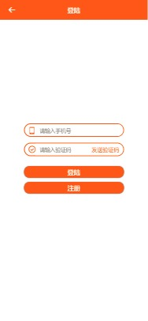
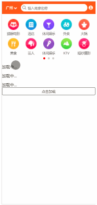

## React 实现大众点评的简单功能 Demo

---

> 项目地址 <a href="http:www.baidu.com">百度</a>

> 技术栈:react,react-router,redux,webpack,es6,babel...

---

### 项目截图

---

* 首页&城市页

    
      

- 登陆页&用户页

    
      

- 搜索页&详情页

    
      

- 项目运行 gif

    

      项目内容一般,主要是在学习react的过程中
      理解它的整个工作流程,数据的处理,路由的配置,
      遗憾的是没有用到中间件来处理数据异步的过程.

---

* 项目简单说明

---

     该项目加深了自己对react技术栈的理解,对于react页面的细粒度，
     和react智能组件和木偶组件的理解,当然也有缺点
     该项目对Redux并没有很深的运用
     只是在边缘试探，没有运用到中间件
     也没有做到react的优化希望大神前来指导

* 项目实现

---

    1. react-router 浏览器传参、获取
    2. 上拉加载更多
    3. 简单收藏效果
    4. 简单评价功能
    5. 选择城市名称
    6. ......

* npm 安装配置项

---

    # clone this demo
    git clone ...

    # install dependencies
    npm i (or yarn)

    # serve with hot reload at localhost:8000
    npm start

* more

---

后续会继续学习技术，增加深度，期待打通前端和后端
